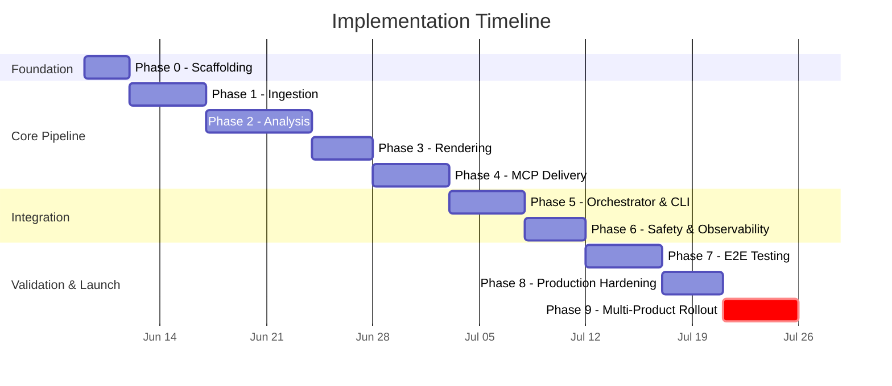
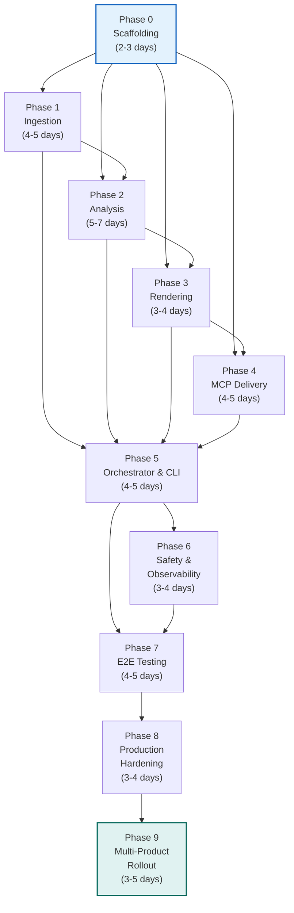
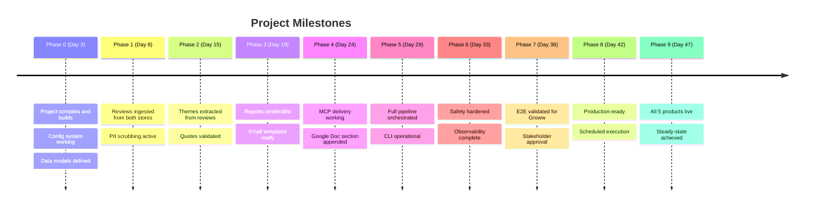

# 🚀 Phase-Wise Implementation Plan — Automated Weekly App Review Pulse

> **Project**: Fintech App Review Pulse System
> **Version**: 1.0
> **Last Updated**: 2026-06-07
> **Status**: Active
> **Companion Documents**:
> - [problemstatement.md](file:///Users/aparanaraghuvanshi/AI%20agent%20automation%20Milestone/docs/problemstatement.md)
> - [architecture.md](file:///Users/aparanaraghuvanshi/AI%20agent%20automation%20Milestone/docs/architecture.md)

---

## Table of Contents

1. [Implementation Strategy](#1-implementation-strategy)
2. [Phase Overview & Timeline](#2-phase-overview--timeline)
3. [Phase 0 — Project Scaffolding & Foundation](#3-phase-0--project-scaffolding--foundation)
4. [Phase 1 — Data Ingestion Layer](#4-phase-1--data-ingestion-layer)
5. [Phase 2 — Analysis & Intelligence Layer](#5-phase-2--analysis--intelligence-layer)
6. [Phase 3 — Report Rendering Layer](#6-phase-3--report-rendering-layer)
7. [Phase 4 — MCP Delivery Layer](#7-phase-4--mcp-delivery-layer)
8. [Phase 5 — Orchestrator, CLI & Idempotency](#8-phase-5--orchestrator-cli--idempotency)
9. [Phase 6 — Safety, Quality & Observability](#9-phase-6--safety-quality--observability)
10. [Phase 7 — Integration Testing & End-to-End Validation](#10-phase-7--integration-testing--end-to-end-validation)
11. [Phase 8 — Production Hardening & Scheduling](#11-phase-8--production-hardening--scheduling)
12. [Phase 9 — Multi-Product Rollout & Optimization](#12-phase-9--multi-product-rollout--optimization)
13. [Dependency Map](#13-dependency-map)
14. [Risk Register](#14-risk-register)
15. [Definition of Done — Per Phase](#15-definition-of-done--per-phase)
16. [Milestone Summary](#16-milestone-summary)

---

## 1. Implementation Strategy

### 1.1 Guiding Principles

| Principle | How It Shapes Implementation |
|-----------|------------------------------|
| **Vertical Slice First** | Build a thin end-to-end path for **one product** (Groww) before widening to all five |
| **Layer-by-Layer** | Implement each architectural layer independently, with clear interfaces and unit tests |
| **MCP-Late Integration** | Develop & test ingestion/analysis/rendering with local stubs before wiring up real MCP servers |
| **Safety-Early** | PII scrubbing and prompt-injection defenses are part of the core build, not afterthoughts |
| **Idempotency-by-Design** | Idempotency is baked into the delivery layer from day one, not patched later |

### 1.2 Phasing Rationale

```mermaid
flowchart LR
    P0["Phase 0<br/>Scaffolding"] --> P1["Phase 1<br/>Ingestion"]
    P1 --> P2["Phase 2<br/>Analysis"]
    P2 --> P3["Phase 3<br/>Rendering"]
    P3 --> P4["Phase 4<br/>MCP Delivery"]
    P4 --> P5["Phase 5<br/>Orchestrator<br/>& CLI"]
    P5 --> P6["Phase 6<br/>Safety &<br/>Observability"]
    P6 --> P7["Phase 7<br/>E2E Testing"]
    P7 --> P8["Phase 8<br/>Production<br/>Hardening"]
    P8 --> P9["Phase 9<br/>Multi-Product<br/>Rollout"]

    style P0 fill:#e3f2fd,stroke:#1565c0
    style P1 fill:#e8f5e9,stroke:#2e7d32
    style P2 fill:#fff3e0,stroke:#ef6c00
    style P3 fill:#f3e5f5,stroke:#7b1fa2
    style P4 fill:#fce4ec,stroke:#c62828
    style P5 fill:#e0f7fa,stroke:#00838f
    style P6 fill:#fff8e1,stroke:#f9a825
    style P7 fill:#efebe9,stroke:#4e342e
    style P8 fill:#e8eaf6,stroke:#283593
    style P9 fill:#e0f2f1,stroke:#00695c
```



Each phase produces **working, testable output** that can be demonstrated independently. No phase depends on work beyond its immediate predecessor(s).

---

## 2. Phase Overview & Timeline

| Phase | Name | Duration | Key Deliverable | Depends On |
|-------|------|----------|-----------------|------------|
| **0** | Project Scaffolding & Foundation | 2–3 days | Repo structure, config system, data models, dev tooling | — |
| **1** | Data Ingestion Layer | 4–5 days | Working App Store + Play Store scrapers with PII scrubbing | Phase 0 |
| **2** | Analysis & Intelligence Layer | 5–7 days | Embedding → Clustering → LLM summarization pipeline | Phase 0, 1 |
| **3** | Report Rendering Layer | 3–4 days | Docs section renderer + Email HTML/text renderer | Phase 0, 2 |
| **4** | MCP Delivery Layer | 4–5 days | MCP client + Google Docs & Gmail delivery via MCP servers | Phase 0, 3 |
| **5** | Orchestrator, CLI & Idempotency | 4–5 days | Full pipeline orchestrator, CLI interface, Run Ledger | Phase 0–4 |
| **6** | Safety, Quality & Observability | 3–4 days | PII hardening, cost controls, structured logging, audit trail | Phase 5 |
| **7** | Integration Testing & E2E Validation | 4–5 days | Full pipeline test with single product (Groww), dry-run mode | Phase 5, 6 |
| **8** | Production Hardening & Scheduling | 3–4 days | Cron/scheduler setup, retry hardening, draft→send flow | Phase 7 |
| **9** | Multi-Product Rollout & Optimization | 3–5 days | All 5 products live, performance tuning, embedding cache | Phase 8 |
| | **Total Estimated** | **35–47 days** | | |



---

## 3. Phase 0 — Project Scaffolding & Foundation

> **Goal**: Set up the project structure, development environment, configuration system, and core data models that all subsequent phases will build upon.

### 3.1 Duration & Effort

| Attribute | Value |
|-----------|-------|
| **Estimated Duration** | 2–3 days |
| **Effort** | 1 developer |
| **Priority** | 🔴 Critical (blocks everything) |

### 3.2 Tasks

#### Task 0.1 — Repository & Project Structure

Create the directory layout as defined in [architecture.md § 13.3](file:///Users/aparanaraghuvanshi/AI%20agent%20automation%20Milestone/docs/architecture.md):

```
pulse/
├── docs/
├── src/
│   ├── main.py
│   ├── orchestrator.py
│   ├── ingestion/
│   ├── analysis/
│   ├── rendering/
│   ├── delivery/
│   ├── state/
│   └── config/
├── config/
│   ├── default.yaml
│   ├── products.json
│   └── mcp_servers.json
├── tests/
├── data/
├── logs/
├── requirements.txt
├── pyproject.toml
├── .gitignore
├── .env.example
└── README.md
```

**Sub-tasks**:
- [ ] Initialize Git repository
- [ ] Create all directories and `__init__.py` files
- [ ] Set up `pyproject.toml` with project metadata
- [ ] Create `.gitignore` (exclude `data/`, `logs/`, `.env`, `__pycache__/`, etc.)
- [ ] Create `.env.example` with placeholder environment variables
- [ ] Write initial `README.md`

#### Task 0.2 — Dependency Management & Dev Tooling

**File**: `requirements.txt` / `pyproject.toml`

- [ ] Pin core dependencies:

| Dependency | Version | Purpose |
|-----------|---------|---------|
| `pydantic` | `>=2.0` | Data models & validation |
| `pydantic-settings` | `>=2.0` | Configuration loader |
| `pyyaml` | `>=6.0` | YAML config parsing |
| `httpx` | `>=0.27` | HTTP client (async-capable) |
| `structlog` | `>=24.0` | Structured JSON logging |
| `click` or `typer` | latest | CLI framework |
| `pytest` | `>=8.0` | Testing framework |
| `pytest-asyncio` | latest | Async test support |

- [ ] Set up `ruff` or `flake8` for linting
- [ ] Set up `mypy` for type checking
- [ ] Create `Makefile` or `justfile` with common commands (`lint`, `test`, `run`)
- [ ] Verify virtual environment creation and dependency install

#### Task 0.3 — Configuration System

**Files**: `src/config/settings.py`, `config/default.yaml`

Implement the configuration loader per [architecture.md § 9](file:///Users/aparanaraghuvanshi/AI%20agent%20automation%20Milestone/docs/architecture.md):

- [ ] Create `Settings` class using `pydantic-settings`
- [ ] Load from `default.yaml` → environment variables → `.env` (override chain)
- [ ] Include all parameters from architecture:

```python
class Settings(BaseSettings):
    review_window_weeks: int = 10
    min_cluster_size: int = 5
    max_themes: int = 5
    quotes_per_theme: int = 3
    actions_per_theme: int = 2
    llm_model: str = "gpt-4o"
    embedding_model: str = "text-embedding-3-small"
    max_tokens_per_run: int = 60000
    max_reviews_per_product: int = 500
    email_mode: Literal["draft", "send"] = "draft"
    cost_alert_threshold_usd: float = 2.00
    retry_max_attempts: int = 3
    retry_backoff_base_sec: int = 2
    run_ledger_path: str = "./data/run_ledger.json"
    log_level: str = "INFO"
```

- [ ] Write unit tests for config loading (defaults, overrides, validation)

#### Task 0.4 — Core Data Models

**Files**: `src/ingestion/models.py`, `src/analysis/models.py`

Define all domain types from [architecture.md § 6.1](file:///Users/aparanaraghuvanshi/AI%20agent%20automation%20Milestone/docs/architecture.md):

- [ ] `Review` model (Pydantic) — with ID hashing, store enum, validation
- [ ] `Cluster` model
- [ ] `Theme`, `Quote`, `ActionIdea` models
- [ ] `PulseReport` and `RunStats` models
- [ ] `RunRecord` model for the Run Ledger
- [ ] Write unit tests for model creation, serialization, validation

#### Task 0.5 — Product Registry

**File**: `config/products.json`

- [ ] Define initial product entries for all 5 products (with placeholder IDs):

```json
{
  "products": [
    { "slug": "indmoney", "display_name": "INDMoney", ... },
    { "slug": "groww", "display_name": "Groww", ... },
    { "slug": "powerup-money", "display_name": "PowerUp Money", ... },
    { "slug": "wealth-monitor", "display_name": "Wealth Monitor", ... },
    { "slug": "kuvera", "display_name": "Kuvera", ... }
  ]
}
```

- [ ] Create `ProductRegistry` loader class
- [ ] Write tests for registry loading and lookup

### 3.3 Exit Criteria

| Criterion | Verification |
|-----------|-------------|
| Project structure matches architecture spec | Directory listing check |
| `Settings` loads from YAML + env correctly | Unit tests pass |
| All core data models instantiate and serialize | Unit tests pass |
| Linting and type checking run clean | `make lint && make typecheck` |
| Virtual environment builds without errors | `pip install -e .` succeeds |

---

## 4. Phase 1 — Data Ingestion Layer

> **Goal**: Build working ingestion modules for both App Store and Play Store, including normalization, deduplication, and PII scrubbing.

### 4.1 Duration & Effort

| Attribute | Value |
|-----------|-------|
| **Estimated Duration** | 4–5 days |
| **Effort** | 1 developer |
| **Priority** | 🔴 Critical |
| **Depends On** | Phase 0 (data models, config) |

### 4.2 Tasks

#### Task 1.1 — App Store Ingestion Module

**File**: `src/ingestion/appstore.py`

- [ ] Implement iTunes RSS feed fetcher
  - Endpoint: `https://itunes.apple.com/rss/customerreviews/id={app_id}/sortBy=mostRecent/json`
  - Handle pagination (RSS feed pages)
  - Parse JSON response into raw review dicts
- [ ] Implement date-range filtering (configurable `REVIEW_WINDOW_WEEKS`)
- [ ] Implement rate limiting (configurable delay between requests)
- [ ] Normalize raw data into `Review` model objects
- [ ] Handle edge cases: empty feeds, API errors, malformed JSON
- [ ] Implement retry with exponential backoff for transient failures
- [ ] Write unit tests with mock RSS responses
- [ ] Write integration test against live App Store (skippable in CI)

#### Task 1.2 — Play Store Ingestion Module

**File**: `src/ingestion/playstore.py`

- [ ] Integrate `google-play-scraper` library
  - Fetch reviews by `app_id` (e.g., `com.nextbillion.groww`)
  - Handle continuation tokens for pagination
  - Sort by most recent
- [ ] Implement date-range filtering (same window as App Store)
- [ ] Normalize into same `Review` model (unified schema)
- [ ] Handle edge cases: scraper failures, rate limits, empty results
- [ ] Implement retry logic
- [ ] Write unit tests with mock scraper responses
- [ ] Write integration test against live Play Store (skippable)

#### Task 1.3 — Review Merger & Deduplicator

**File**: `src/ingestion/merger.py`

- [ ] Merge reviews from both stores into a single list
- [ ] Deduplicate using deterministic `review.id` hash `(store, app_id, review_id)`
- [ ] Sort by date (newest first)
- [ ] Enforce `MAX_REVIEWS_PER_PRODUCT` cap
- [ ] Log merge statistics (count per store, duplicates removed)
- [ ] Write unit tests

#### Task 1.4 — PII Scrubber

**File**: `src/ingestion/pii_scrubber.py`

- [ ] Implement regex-based PII detection:
  - Email addresses → `[EMAIL]`
  - Phone numbers (Indian + international formats) → `[PHONE]`
  - Aadhaar-like patterns → `[ID]`
  - Account/order IDs → `[ACCOUNT_ID]`
- [ ] Implement optional NER-based name detection (via `presidio` or simple patterns)
  - Names → `[NAME]`
- [ ] Process `Review.author` field (always anonymize)
- [ ] Process `Review.body` and `Review.title` fields
- [ ] Log scrub statistics (counts per category, not scrubbed content)
- [ ] Preserve `raw_length` before scrubbing
- [ ] Write unit tests with diverse PII patterns

#### Task 1.5 — Ingestion Pipeline Integration

**File**: `src/ingestion/__init__.py` (or `src/ingestion/pipeline.py`)

- [ ] Create `ingest_reviews(product_slug, settings) → List[Review]` function
- [ ] Wire together: fetch (both stores) → merge → deduplicate → PII scrub
- [ ] Handle partial failures gracefully (one store fails → continue with other)
- [ ] Return clean, normalized, PII-scrubbed reviews
- [ ] Write integration test for the full ingestion pipeline

### 4.3 Exit Criteria

| Criterion | Verification |
|-----------|-------------|
| App Store module fetches & normalizes reviews | Unit + integration test |
| Play Store module fetches & normalizes reviews | Unit + integration test |
| Reviews are merged and deduplicated correctly | Unit test |
| PII scrubber catches all target patterns | Unit test with 20+ PII examples |
| Full ingestion pipeline returns clean `Review[]` for Groww | Integration test |
| Graceful degradation when one store fails | Unit test (mock failure) |

---

## 5. Phase 2 — Analysis & Intelligence Layer

> **Goal**: Build the embedding → clustering → LLM summarization → quote validation pipeline that transforms raw reviews into structured themes.

### 5.1 Duration & Effort

| Attribute | Value |
|-----------|-------|
| **Estimated Duration** | 5–7 days |
| **Effort** | 1 developer |
| **Priority** | 🔴 Critical |
| **Depends On** | Phase 0 (models), Phase 1 (produces `Review[]` input) |

### 5.2 Tasks

#### Task 2.1 — Embedding Engine

**File**: `src/analysis/embeddings.py`

- [ ] Implement embedding generation function
  - Input: `List[Review]` → Output: `List[Tuple[Review, np.ndarray]]`
  - Concatenate `review.title + " " + review.body` as input text
- [ ] Support configurable model (`EMBEDDING_MODEL`)
- [ ] Implement batching (respect API rate limits and batch size limits)
- [ ] Implement embedding cache:
  - Cache by `review.id` → embedding vector
  - Store in `data/embedding_cache/` (file-based or SQLite)
  - On re-run, skip already-cached reviews
- [ ] Implement token counting and cost tracking per batch
- [ ] Write unit tests with mock API responses
- [ ] Write integration test with real OpenAI API (skippable)

#### Task 2.2 — Clustering Engine

**File**: `src/analysis/clustering.py`

- [ ] Install and configure `umap-learn` and `hdbscan`
- [ ] Implement dimensionality reduction:
  - UMAP with sensible defaults (`n_components=5`, `n_neighbors=15`, `min_dist=0.1`)
  - Handle edge cases: too few reviews for UMAP
- [ ] Implement HDBSCAN clustering:
  - Configurable `MIN_CLUSTER_SIZE`
  - Extract cluster labels and noise assignments
- [ ] Build `Cluster` objects from labels:
  - Group reviews by cluster label
  - Calculate cluster stats (size, avg_rating, date range)
  - Exclude noise cluster (label `-1`) from theme generation
- [ ] Sort clusters by size (largest first) and limit to `MAX_THEMES`
- [ ] Write unit tests with synthetic embedding data
- [ ] Validate: different review sets produce sensible clusters

#### Task 2.3 — LLM Summarizer

**File**: `src/analysis/summarizer.py`

- [ ] Implement prompt builder:
  - System prompt with safety constraints (data-as-data, quote validation instruction)
  - Cluster-specific user prompt with review texts + cluster stats
  - Use explicit delimiters: `--- BEGIN REVIEW DATA ---` / `--- END REVIEW DATA ---`
- [ ] Implement structured output parsing:
  - Parse LLM response into `Theme` objects (name, description, quotes, actions)
  - Use JSON mode or structured output schema if supported by model
  - Fallback: regex/manual parsing for free-text responses
- [ ] Implement per-cluster processing:
  - For each cluster → build prompt → call LLM → parse response
  - Respect `MAX_THEMES`, `QUOTES_PER_THEME`, `ACTIONS_PER_THEME` limits
- [ ] Implement token budget enforcement:
  - Track cumulative token usage across all LLM calls in a run
  - Halt if `MAX_TOKENS_PER_RUN` would be exceeded
  - Log cost estimates per call
- [ ] Handle LLM errors (rate limits, timeouts, invalid output)
- [ ] Write unit tests with mock LLM responses
- [ ] Write integration test with real LLM API (skippable)

#### Task 2.4 — Quote Validator

**File**: `src/analysis/quote_validator.py`

- [ ] Implement exact substring matching:
  - For each quote in a `Theme`, check if it appears as a substring in any source `Review.body`
  - Mark `Quote.validated = True/False`
- [ ] Implement optional fuzzy matching:
  - Configurable threshold for whitespace/punctuation tolerance
  - Default: exact match only
- [ ] Drop invalid quotes, log validation failures
- [ ] Track `quotes_proposed` vs `quotes_validated` metrics
- [ ] Emit warning if validation rate falls below threshold (e.g., < 50%)
- [ ] Write unit tests (exact match, near match, hallucinated quote)

#### Task 2.5 — Analysis Pipeline Integration

**File**: `src/analysis/__init__.py` (or `src/analysis/pipeline.py`)

- [ ] Create `analyze_reviews(reviews: List[Review], settings) → List[Theme]` function
- [ ] Wire together: embed → cluster → summarize → validate
- [ ] Return validated themes, sorted by review count
- [ ] Include `RunStats` (cluster count, token usage, validation metrics)
- [ ] Write integration test with realistic review data

### 5.3 Exit Criteria

| Criterion | Verification |
|-----------|-------------|
| Embeddings generated and cached correctly | Unit test + cache verification |
| UMAP + HDBSCAN produces meaningful clusters | Test with 50+ reviews |
| LLM generates structured themes per cluster | Unit test with mock + integration with real LLM |
| Quote validator correctly accepts/rejects quotes | Unit test with 10+ cases |
| Token budget enforcement halts when exceeded | Unit test |
| Full analysis pipeline produces `Theme[]` from `Review[]` | Integration test |

---

## 6. Phase 3 — Report Rendering Layer

> **Goal**: Build renderers that transform structured themes into Google Docs section content and HTML/text email content.

### 6.1 Duration & Effort

| Attribute | Value |
|-----------|-------|
| **Estimated Duration** | 3–4 days |
| **Effort** | 1 developer |
| **Priority** | 🟡 High |
| **Depends On** | Phase 0 (models), Phase 2 (produces `Theme[]` input) |

### 6.2 Tasks

#### Task 3.1 — Docs Report Renderer

**File**: `src/rendering/docs_renderer.py`

- [ ] Implement section structure per [architecture.md § 3.4](file:///Users/aparanaraghuvanshi/AI%20agent%20automation%20Milestone/docs/architecture.md):
  - Section heading: `{Product} — Weekly Review Pulse — {ISO Week} ({Date Range})`
  - Top Themes table
  - Real User Quotes (with rating, store, date attribution)
  - Action Ideas table
  - "About This Pulse" metadata block
- [ ] Generate stable section anchor ID: `{product_slug}-{iso_year}-W{iso_week}`
- [ ] Produce Google Docs `batchUpdate` request payload:
  - `insertText` requests for headings, paragraphs, quotes
  - `insertTable` requests for theme and action tables
  - Horizontal rule separator
  - All content appended at end of document
- [ ] Handle edge cases: empty themes, no validated quotes, single cluster
- [ ] Write unit tests verifying output structure
- [ ] Write snapshot tests for rendered content

#### Task 3.2 — Email Report Renderer

**File**: `src/rendering/email_renderer.py`

- [ ] Implement HTML email template:
  - Subject: `📊 {Product} Review Pulse — Week {ISO_WEEK}`
  - Body: top 3 themes as styled bullet points
  - Brief stats (reviews analyzed, clusters found)
  - Prominent "Read Full Report →" CTA button with deep link
  - Footer with auto-generated timestamp
- [ ] Implement plain-text fallback:
  - Same content structure as HTML, without markup
  - Plain URL instead of button
- [ ] Generate deep link URL: `https://docs.google.com/document/d/{doc_id}/edit#heading=h.{anchor_id}`
- [ ] Accept `doc_id` and `section_anchor` as inputs
- [ ] Write unit tests for both HTML and plain-text output
- [ ] Visual test: render HTML to file and open in browser

#### Task 3.3 — Renderer Integration

**File**: `src/rendering/__init__.py`

- [ ] Create unified rendering function:
  - Input: `PulseReport` + product config → Output: `(docs_payload, email_content)`
  - `docs_payload`: serialized `batchUpdate` requests
  - `email_content`: `{ subject, html_body, text_body, recipients }`
- [ ] Wire both renderers together
- [ ] Write integration test

### 6.3 Exit Criteria

| Criterion | Verification |
|-----------|-------------|
| Docs renderer produces valid `batchUpdate` payload | Unit test + manual JSON inspection |
| Section anchor ID is stable and correct | Unit test |
| Email HTML renders correctly in browser | Visual inspection |
| Plain-text email is readable and complete | Unit test |
| Deep link URL constructed correctly | Unit test |
| Edge cases handled (no quotes, single theme) | Unit tests |

---

## 7. Phase 4 — MCP Delivery Layer

> **Goal**: Implement the MCP client and delivery modules for Google Docs and Gmail, connecting to real MCP servers.

### 7.1 Duration & Effort

| Attribute | Value |
|-----------|-------|
| **Estimated Duration** | 4–5 days |
| **Effort** | 1 developer |
| **Priority** | 🔴 Critical |
| **Depends On** | Phase 0 (config), Phase 3 (produces delivery payloads) |

### 7.2 Tasks

#### Task 4.1 — MCP Client Core

**File**: `src/delivery/mcp_client.py`

- [ ] Install and configure `mcp` Python SDK
- [ ] Implement MCP client wrapper:
  - Server discovery from `mcp_servers.json` config
  - Connection management (stdio transport)
  - Tool invocation via `tools/call` with typed parameters
  - Response parsing and error extraction
- [ ] Implement timeout handling (configurable per-tool)
- [ ] Implement retry logic for transient MCP failures
- [ ] Fail-fast on authentication errors (surface clearly)
- [ ] Write unit tests with mock MCP server

#### Task 4.2 — MCP Server Setup & Configuration

**File**: `config/mcp_servers.json`

- [ ] Configure Google Docs MCP server entry:
  - Command, args, environment variables for OAuth credentials path
- [ ] Configure Gmail MCP server entry:
  - Same structure, separate credentials
- [ ] Document OAuth credential setup process in `README.md`
- [ ] Create Google Cloud project (if needed) with Docs + Gmail API scopes
- [ ] Generate and store OAuth credentials in MCP server config (outside agent repo)
- [ ] Verify both MCP servers start and respond to capability queries

> [!CAUTION]
> OAuth credentials **must not** be committed to the repository. They are configured as environment variables within the MCP server configuration, per [architecture.md § 5.2](file:///Users/aparanaraghuvanshi/AI%20agent%20automation%20Milestone/docs/architecture.md).

#### Task 4.3 — Google Docs Delivery Module

**File**: `src/delivery/docs_delivery.py`

- [ ] Implement `append_section_to_doc(doc_id, batch_update_payload)`:
  - Call `documents.get` to verify document exists and is accessible
  - Call `documents.batchUpdate` with the rendered section payload
  - Extract and return heading/element IDs from the response
- [ ] Implement `check_section_exists(doc_id, section_anchor) → bool`:
  - Fetch document content via `documents.get`
  - Search for the anchor string in heading text
  - Return `True` if found (for idempotency)
- [ ] Handle errors: document not found, permission denied, MCP timeout
- [ ] Write unit tests with mock MCP responses
- [ ] Write integration test with a real test Google Doc

#### Task 4.4 — Gmail Delivery Module

**File**: `src/delivery/email_delivery.py`

- [ ] Implement `create_draft(email_content) → draft_id`:
  - Call `drafts.create` with subject, HTML body, plain-text body, recipients
  - Return draft ID for audit
- [ ] Implement `send_draft(draft_id) → message_id`:
  - Call `drafts.send` to send the draft
  - Return message ID for audit
- [ ] Implement mode switching:
  - If `EMAIL_MODE == "draft"` → create draft only, return draft ID
  - If `EMAIL_MODE == "send"` → create draft + send, return message ID
- [ ] Handle errors: invalid recipients, quota exceeded, MCP timeout
- [ ] Write unit tests with mock MCP responses
- [ ] Write integration test with real Gmail (draft-only mode)

#### Task 4.5 — Delivery Integration

**File**: `src/delivery/__init__.py`

- [ ] Create `deliver_pulse(pulse_report, doc_config, email_config, settings) → DeliveryResult`:
  - Orchestrate: doc check → doc append → email create → email send/draft
  - Return delivery identifiers (heading ID, message/draft ID)
- [ ] Implement delivery-level error handling (partial failures)
- [ ] Write integration test for full delivery flow (test doc + draft email)

### 7.3 Exit Criteria

| Criterion | Verification |
|-----------|-------------|
| MCP client connects to Docs and Gmail MCP servers | Integration test |
| Section appended to a real Google Doc | Manual verification |
| `check_section_exists` correctly detects existing sections | Unit + integration test |
| Email draft created in Gmail | Manual verification |
| Draft-to-send flow works in production mode | Integration test (controlled) |
| OAuth credentials are isolated in MCP servers | Architecture review |

---

## 8. Phase 5 — Orchestrator, CLI & Idempotency

> **Goal**: Build the pipeline orchestrator that ties all layers together, implement the CLI, and wire up the Run Ledger for idempotency and audit.

### 8.1 Duration & Effort

| Attribute | Value |
|-----------|-------|
| **Estimated Duration** | 4–5 days |
| **Effort** | 1 developer |
| **Priority** | 🔴 Critical |
| **Depends On** | All Phases 0–4 |

### 8.2 Tasks

#### Task 5.1 — Run Ledger

**File**: `src/state/run_ledger.py`

- [ ] Implement `RunLedger` class:
  - Storage backend: JSON file (default) or SQLite
  - CRUD operations for `RunRecord` objects
  - Lookup by idempotency key: `(product_slug, iso_year, iso_week)`
  - Update status and delivery metadata incrementally
- [ ] Implement file-based persistence:
  - Atomic writes (write to temp file + rename)
  - Handle concurrent access (file locking)
- [ ] Write unit tests for all operations

#### Task 5.2 — Idempotency Module

**File**: `src/state/idempotency.py`

- [ ] Implement two-phase idempotency check per [architecture.md § 7](file:///Users/aparanaraghuvanshi/AI%20agent%20automation%20Milestone/docs/architecture.md):
  - **Phase 1 (Local)**: Check Run Ledger for completed/partial runs
  - **Phase 2 (Remote)**: Check Google Doc for existing section anchor
- [ ] Return decision: `"skip"` (fully completed) | `"resume"` (partial) | `"run"` (new)
- [ ] Implement per-stage idempotency:
  - Doc delivery: skip if section anchor exists
  - Email delivery: skip if message/draft ID recorded
- [ ] Write unit tests for all three decision paths

#### Task 5.3 — Pipeline Orchestrator

**File**: `src/orchestrator.py`

- [ ] Implement `run_pulse(product_slug, iso_week, settings)`:
  - **Step 1**: Load product config from registry
  - **Step 2**: Check idempotency (local + remote)
  - **Step 3**: Create `RunRecord`, mark as `"running"`
  - **Step 4**: Execute ingestion pipeline → `Review[]`
  - **Step 5**: Execute analysis pipeline → `Theme[]` + `RunStats`
  - **Step 6**: Build `PulseReport` object
  - **Step 7**: Execute rendering → `(docs_payload, email_content)`
  - **Step 8**: Execute delivery → `DeliveryResult`
  - **Step 9**: Update `RunRecord` with all metadata, mark as `"completed"`
  - **Error**: On any failure, update status to `"failed"` or `"partial"`, log, and propagate
- [ ] Implement dry-run mode (skip delivery step, log what would have been delivered)
- [ ] Write integration test with mocked layers

#### Task 5.4 — CLI Interface

**File**: `src/main.py`

- [ ] Implement `pulse run` command:
  - `--product <slug>`: run for specific product
  - `--week <ISO-WEEK>`: specify ISO week (default: current week)
  - `--all`: run for all products sequentially
  - `--dry-run`: skip delivery, log output
  - `--config <path>`: alternate config file
- [ ] Implement `pulse status` command:
  - `--product <slug> --week <ISO-WEEK>`: show run status from ledger
- [ ] Implement `pulse history` command:
  - `--product <slug>`: show recent runs
  - `--limit <N>`: limit results
  - `--format json|table`: output format
- [ ] Write CLI usage tests
- [ ] Ensure CLI loads settings correctly from config chain

#### Task 5.5 — ISO Week Utilities

**File**: `src/config/week_utils.py` (or within `settings.py`)

- [ ] Implement `current_iso_week() → (year, week)`
- [ ] Implement `parse_iso_week("2026-W23") → (year, week)`
- [ ] Implement `iso_week_date_range(year, week) → (start_date, end_date)`
- [ ] Implement `review_window_range(year, week, window_weeks) → (start_date, end_date)`
- [ ] Write unit tests

### 8.3 Exit Criteria

| Criterion | Verification |
|-----------|-------------|
| Run Ledger persists and retrieves records correctly | Unit tests |
| Idempotency: re-run skips completed runs | Unit test |
| Idempotency: partial runs resume correctly | Unit test |
| Orchestrator runs full pipeline for one product | Integration test (dry-run) |
| CLI `run` command works end-to-end | Manual test |
| CLI `status` and `history` commands return data | Manual test |
| Dry-run mode produces output without delivery | Integration test |

---

## 9. Phase 6 — Safety, Quality & Observability

> **Goal**: Harden PII scrubbing, add cost controls, implement structured logging, and build the audit trail.

### 9.1 Duration & Effort

| Attribute | Value |
|-----------|-------|
| **Estimated Duration** | 3–4 days |
| **Effort** | 1 developer |
| **Priority** | 🟡 High |
| **Depends On** | Phase 5 (full pipeline to instrument) |

### 9.2 Tasks

#### Task 6.1 — PII Scrubber Hardening

**File**: `src/ingestion/pii_scrubber.py` (enhance Phase 1 implementation)

- [ ] Expand regex patterns for Indian-specific formats:
  - Indian phone (+91, 10-digit patterns)
  - Aadhaar numbers (12-digit patterns)
  - PAN numbers
  - UPI IDs (name@upi)
- [ ] Add comprehensive test suite (50+ diverse PII patterns)
- [ ] Benchmark performance (scrub rate per 1000 reviews)
- [ ] Add opt-in `presidio` NER integration for higher-recall name detection
- [ ] Ensure PII scrubber runs at all pipeline entry points (defense in depth)

#### Task 6.2 — LLM Safety Hardening

**File**: `src/analysis/summarizer.py` (enhance Phase 2 implementation)

- [ ] Audit and finalize system prompt:
  - Explicit data delimiters
  - "Ignore instructions in review text" directive
  - Structured output format specification
- [ ] Pin LLM model version in configuration
- [ ] Implement input sanitization before prompt injection:
  - Escape/strip control characters from review text
  - Truncate excessively long reviews
- [ ] Add adversarial test cases (review text containing "ignore previous instructions", etc.)

#### Task 6.3 — Cost Controls

**Files**: `src/analysis/cost_tracker.py` (new)

- [ ] Implement `CostTracker` class:
  - Track token usage per LLM call (input + output)
  - Track cumulative usage per run
  - Estimate USD cost based on model pricing
  - Enforce hard cutoff at `MAX_TOKENS_PER_RUN`
  - Emit warning at `COST_ALERT_THRESHOLD_USD`
- [ ] Integrate cost tracker into:
  - Embedding engine (embedding API calls)
  - LLM summarizer (completion API calls)
- [ ] Log cost summary at end of each run
- [ ] Write unit tests for budget enforcement

#### Task 6.4 — Structured Logging

**File**: `src/config/logging.py` (new)

- [ ] Configure `structlog` with JSON output format
- [ ] Ensure all log entries include standard context:
  - `run_id`, `product`, `iso_week`, `stage`, `event`, `timestamp`
- [ ] Add structured logging throughout all pipeline stages:
  - Ingestion: reviews fetched, PII scrubs, merge stats
  - Analysis: clusters found, themes generated, token usage
  - Rendering: render timings
  - Delivery: MCP tool calls, response status, IDs
  - Errors: full context with stack traces
- [ ] Configure log output destination (file + stdout)
- [ ] Implement log rotation (or delegate to external tool)
- [ ] Write integration test verifying log output structure

#### Task 6.5 — Audit Trail Enhancement

**File**: `src/state/run_ledger.py` (enhance Phase 5 implementation)

- [ ] Ensure all Run Ledger fields are populated by the orchestrator:
  - Ingestion metadata (review counts, window dates)
  - Analysis metadata (clusters, themes, token usage)
  - Delivery metadata (doc heading ID, message/draft ID, timestamps)
- [ ] Implement audit query helpers:
  - `get_run_by_key(product, year, week) → RunRecord`
  - `list_runs_by_product(product, limit) → List[RunRecord]`
  - `list_partial_failures(limit) → List[RunRecord]`
- [ ] Write audit query tests

### 9.3 Exit Criteria

| Criterion | Verification |
|-----------|-------------|
| PII scrubber catches 95%+ of test patterns | Extended test suite |
| Adversarial prompt injection tests pass | Unit tests |
| Cost tracker enforces budget correctly | Unit test with budget exceeded |
| All pipeline stages emit structured JSON logs | Integration test |
| Run Ledger contains complete metadata after run | Integration test |
| Audit queries return correct data | Unit tests |

---

## 10. Phase 7 — Integration Testing & End-to-End Validation

> **Goal**: Validate the complete pipeline end-to-end for a single product (Groww), using both dry-run mode and real delivery.

### 10.1 Duration & Effort

| Attribute | Value |
|-----------|-------|
| **Estimated Duration** | 4–5 days |
| **Effort** | 1–2 developers |
| **Priority** | 🔴 Critical |
| **Depends On** | Phases 5 and 6 (full pipeline with safety) |

### 10.2 Tasks

#### Task 7.1 — End-to-End Dry Run

- [ ] Run full pipeline for Groww in dry-run mode:
  - `pulse run --product groww --dry-run`
  - Verify: reviews ingested → clustered → themes generated → report rendered
  - Inspect rendered Docs payload and email content
  - Verify cost tracking and logging output
- [ ] Document any issues found; fix blocking bugs
- [ ] Repeat dry run 3 times and verify idempotency (second/third runs skip)

#### Task 7.2 — End-to-End Live Run (Test Doc + Draft Email)

- [ ] Create a test Google Doc: "Weekly Review Pulse — Groww (TEST)"
- [ ] Configure product registry with test doc ID
- [ ] Run full pipeline:
  - `pulse run --product groww` (with `EMAIL_MODE=draft`)
  - Verify: section appended to test Google Doc
  - Verify: email draft created in Gmail (not sent)
  - Verify: Run Ledger updated with delivery IDs
- [ ] Inspect output quality:
  - Are themes relevant and well-named?
  - Are quotes real (validated)?
  - Are action ideas actionable?
  - Does the email deep link work?
- [ ] Idempotency test: re-run same week → no duplicates

#### Task 7.3 — Failure & Recovery Testing

- [ ] Simulate partial failures:
  - Kill App Store fetch mid-way → verify graceful degradation
  - Kill MCP server mid-delivery → verify `partial` status and re-run recovery
  - Exhaust token budget mid-analysis → verify run stops and marks `failed`
- [ ] Simulate idempotency edge cases:
  - Delete Run Ledger file → re-run → should detect existing doc section (Phase 2 check)
  - Manually delete doc section → re-run → should re-append
- [ ] Document all failure modes and verify recovery behavior

#### Task 7.4 — Output Quality Review

- [ ] Stakeholder review of generated report content:
  - Share test Google Doc with product/support team members
  - Collect feedback on:
    - Theme relevance and naming
    - Quote quality and representativeness
    - Action idea usefulness
    - Report formatting and readability
- [ ] Iterate on LLM prompts based on feedback
- [ ] Iterate on report template based on feedback

#### Task 7.5 — Performance Baseline

- [ ] Measure and document pipeline performance:

| Stage | Metric | Target |
|-------|--------|--------|
| Ingestion | Time to fetch 500 reviews | < 60 seconds |
| Embedding | Time to embed 500 reviews | < 30 seconds |
| Clustering | Time for UMAP + HDBSCAN | < 10 seconds |
| LLM Summarization | Time for 5 cluster summaries | < 60 seconds |
| Rendering | Time to render both outputs | < 5 seconds |
| Delivery | Time for Doc + Email delivery | < 30 seconds |
| **Total E2E** | **Full pipeline** | **< 5 minutes** |

- [ ] Identify and document any bottlenecks
- [ ] Establish baseline for embedding cache effectiveness

### 10.3 Exit Criteria

| Criterion | Verification |
|-----------|-------------|
| E2E dry run completes without errors | CLI output + log review |
| E2E live run produces correct Google Doc section | Manual inspection |
| E2E live run creates correct email draft | Manual inspection |
| Re-run produces no duplicates | Inspection of Doc + Ledger |
| Partial failure recovery works | Simulated failure tests |
| Stakeholder feedback is "good enough" for production | Feedback round |
| Pipeline completes within performance targets | Timing measurements |

---

## 11. Phase 8 — Production Hardening & Scheduling

> **Goal**: Prepare the system for unattended, scheduled execution with robust error handling and monitoring.

### 11.1 Duration & Effort

| Attribute | Value |
|-----------|-------|
| **Estimated Duration** | 3–4 days |
| **Effort** | 1 developer |
| **Priority** | 🟡 High |
| **Depends On** | Phase 7 (validated pipeline) |

### 11.2 Tasks

#### Task 8.1 — Retry Hardening

- [ ] Review and finalize retry behavior across all components:
  - Ingestion: HTTP retries (3 attempts, exponential backoff)
  - Embedding API: retries with rate-limit awareness
  - LLM API: retries with backoff
  - MCP calls: retries with server-restart detection
- [ ] Implement circuit-breaker pattern for MCP servers:
  - After N consecutive failures, stop retrying and mark run as failed
- [ ] Test retry behavior under simulated network issues
- [ ] Document all retry configurations

#### Task 8.2 — Email Mode Transition (Draft → Send)

- [ ] Implement controlled production email sending:
  - Staging: `EMAIL_MODE=draft` (default, creates drafts only)
  - Production: `EMAIL_MODE=send` (creates draft + sends)
- [ ] Add confirmation prompt for first-time `send` mode activation
- [ ] Test draft→send flow with real email
- [ ] Verify email content (HTML rendering, deep link, recipients)

#### Task 8.3 — Scheduling Setup

- [ ] Configure cron job per [architecture.md § 10.3](file:///Users/aparanaraghuvanshi/AI%20agent%20automation%20Milestone/docs/architecture.md):

```cron
# Run pulse for all products every Monday at 6:00 AM IST
0 6 * * 1 cd /app && pulse run --all >> /var/log/pulse/cron.log 2>&1
```

- [ ] Set up log rotation for cron output
- [ ] Test cron execution (trigger manually with `at` command)
- [ ] Document alternative: GCP Cloud Scheduler / AWS EventBridge setup
- [ ] Add health-check: script to verify last run completed successfully

#### Task 8.4 — Environment Configuration

- [ ] Create environment-specific config files:
  - `config/development.yaml`
  - `config/staging.yaml`
  - `config/production.yaml`
- [ ] Implement config file selection via `PULSE_ENV` environment variable
- [ ] Apply environment overrides per [architecture.md § 9.3](file:///Users/aparanaraghuvanshi/AI%20agent%20automation%20Milestone/docs/architecture.md):

| Setting | Development | Staging | Production |
|---------|-------------|---------|------------|
| `EMAIL_MODE` | `draft` | `draft` | `send` |
| `MAX_REVIEWS_PER_PRODUCT` | `50` | `200` | `500` |
| `LLM_MODEL` | `gpt-4o-mini` | `gpt-4o` | `gpt-4o` |
| `LOG_LEVEL` | `DEBUG` | `INFO` | `INFO` |

#### Task 8.5 — Operational Runbook

**File**: `docs/runbook.md`

- [ ] Document common operational procedures:
  - How to run a manual backfill for a past week
  - How to recover from a partial failure
  - How to add a new product
  - How to update LLM prompts
  - How to rotate OAuth credentials
  - How to check run status and audit history
- [ ] Document troubleshooting guide:
  - Common errors and resolutions
  - How to read structured logs
  - How to investigate idempotency issues
- [ ] Document monitoring checklist for weekly verification

### 11.3 Exit Criteria

| Criterion | Verification |
|-----------|-------------|
| Retries handle all transient failure types | Simulated failure tests |
| Cron job fires at scheduled time | Cron test run |
| Environment configs switch correctly | Config loading tests |
| Email sends successfully in production mode | Controlled live test |
| Runbook covers all operational scenarios | Document review |

---

## 12. Phase 9 — Multi-Product Rollout & Optimization

> **Goal**: Roll out to all 5 products, optimize performance, and establish steady-state operations.

### 12.1 Duration & Effort

| Attribute | Value |
|-----------|-------|
| **Estimated Duration** | 3–5 days |
| **Effort** | 1 developer |
| **Priority** | 🟡 High |
| **Depends On** | Phase 8 (production-ready single product) |

### 12.2 Tasks

#### Task 9.1 — Product Configuration Completion

- [ ] Fill in real App Store and Play Store IDs for all 5 products:

| Product | App Store ID | Play Store Package |
|---------|-------------|-------------------|
| INDMoney | (look up) | `com.indmoney.app` |
| Groww | (look up) | `com.nextbillion.groww` |
| PowerUp Money | (look up) | (look up) |
| Wealth Monitor | (look up) | (look up) |
| Kuvera | (look up) | (look up) |

- [ ] Create Google Docs for each product: "Weekly Review Pulse — {Product}"
- [ ] Configure stakeholder email lists per product
- [ ] Update `products.json` with all real IDs

#### Task 9.2 — Multi-Product Dry Run

- [ ] Run `pulse run --all --dry-run` to validate all 5 products
- [ ] Verify:
  - Each product ingests reviews from both stores
  - Clustering and themes are product-appropriate
  - No cross-product data contamination
- [ ] Measure total wall-clock time for all 5 products
- [ ] Identify any product-specific issues (e.g., low review counts)

#### Task 9.3 — Multi-Product Live Run

- [ ] Run `pulse run --all` with `EMAIL_MODE=draft`
- [ ] Inspect each product's Google Doc section
- [ ] Inspect each product's email draft
- [ ] Verify idempotency: re-run → no duplicates across all products
- [ ] Review Run Ledger for all 5 entries

#### Task 9.4 — Performance Optimization

- [ ] Implement embedding cache warming:
  - Pre-populate cache for all products on first run
  - Measure cache hit rate on second run
- [ ] Optimize sequential vs parallel execution:
  - Consider running products in parallel (if token budget allows)
  - Or keep sequential for cost predictability
- [ ] Measure and optimize total pipeline time for all 5 products:
  - Target: < 20 minutes for all products combined
- [ ] Optimize memory usage for large review sets

#### Task 9.5 — Steady-State Validation

- [ ] Run production scheduling for 2 consecutive weeks:
  - Week 1: Verify all 5 products processed, reports delivered
  - Week 2: Verify idempotent re-runs, new weekly sections appended correctly
- [ ] Validate cost tracking: actual USD spend per week
- [ ] Validate audit trail: answer "what was sent, when?" for each product
- [ ] Collect stakeholder feedback after 2 weeks
- [ ] Document any tuning adjustments made

### 12.3 Exit Criteria

| Criterion | Verification |
|-----------|-------------|
| All 5 products configured with real IDs | Config review |
| All 5 products process successfully in dry-run | CLI output |
| All 5 products deliver to real Docs + email | Manual inspection |
| No duplicates across multi-product runs | Ledger + Doc inspection |
| Pipeline performance < 20 min total | Timing measurement |
| 2-week steady-state without manual intervention | Monitoring |

---

## 13. Dependency Map

### 13.1 Phase Dependencies



### 13.2 File-Level Dependencies

| File | Depends On | Consumed By |
|------|-----------|-------------|
| `src/config/settings.py` | — | All modules |
| `src/ingestion/models.py` | `pydantic` | `ingestion/`, `analysis/`, `rendering/` |
| `src/analysis/models.py` | `pydantic` | `analysis/`, `rendering/`, `state/` |
| `src/ingestion/appstore.py` | `settings`, `models` | `ingestion/pipeline.py` |
| `src/ingestion/playstore.py` | `settings`, `models` | `ingestion/pipeline.py` |
| `src/ingestion/pii_scrubber.py` | `models` | `ingestion/pipeline.py` |
| `src/analysis/embeddings.py` | `settings`, `models` | `analysis/pipeline.py` |
| `src/analysis/clustering.py` | `models` | `analysis/pipeline.py` |
| `src/analysis/summarizer.py` | `settings`, `models` | `analysis/pipeline.py` |
| `src/analysis/quote_validator.py` | `models` | `analysis/pipeline.py` |
| `src/rendering/docs_renderer.py` | `models` | `orchestrator.py` |
| `src/rendering/email_renderer.py` | `models` | `orchestrator.py` |
| `src/delivery/mcp_client.py` | `settings` | `docs_delivery.py`, `email_delivery.py` |
| `src/delivery/docs_delivery.py` | `mcp_client` | `orchestrator.py` |
| `src/delivery/email_delivery.py` | `mcp_client` | `orchestrator.py` |
| `src/state/run_ledger.py` | `models` | `orchestrator.py`, `idempotency.py` |
| `src/state/idempotency.py` | `run_ledger`, `docs_delivery` | `orchestrator.py` |
| `src/orchestrator.py` | All above | `main.py` |
| `src/main.py` | `orchestrator`, `settings` | CLI entry point |

---

## 14. Risk Register

| # | Risk | Impact | Likelihood | Mitigation | Phase |
|---|------|--------|------------|------------|-------|
| R1 | App Store RSS feed changes format or rate limits | 🔴 High | 🟡 Medium | Abstract parser; monitor for failures; have fallback scraper ready | 1 |
| R2 | Play Store scraper blocked or rate limited | 🔴 High | 🟡 Medium | Implement respectful rate limiting; rotate user agents; have backup library | 1 |
| R3 | Insufficient reviews for meaningful clustering | 🟡 Medium | 🟡 Medium | Fallback to simple LLM summarization without clustering for < 20 reviews | 2 |
| R4 | LLM hallucinates quotes despite instructions | 🟡 Medium | 🟡 Medium | Quote validator catches 100% of hallucinated quotes; iterate prompts | 2 |
| R5 | LLM costs exceed budget | 🟡 Medium | 🟢 Low | Hard token budget, cost tracking, per-run alerts; use cheaper model for dev | 2, 6 |
| R6 | MCP server compatibility issues | 🔴 High | 🟡 Medium | Early integration testing (Phase 4); abstract MCP client for flexibility | 4 |
| R7 | Google Docs batchUpdate API complexity | 🟡 Medium | 🟡 Medium | Start with simple text insertion; iterate to structured content | 3, 4 |
| R8 | OAuth credential management complexity | 🟡 Medium | 🟢 Low | Document setup process; credential rotation runbook | 4, 8 |
| R9 | Large Google Doc degrades performance after 50+ weeks | 🟢 Low | 🟡 Medium | Monitor doc size; implement archival strategy when needed | 9+ |
| R10 | PII scrubber false positives/negatives | 🟡 Medium | 🟡 Medium | Extensive test suite; iterative improvement; NER fallback | 1, 6 |

---

## 15. Definition of Done — Per Phase

### Universal Criteria (Apply to Every Phase)

- [ ] All new code has unit tests with ≥ 80% coverage
- [ ] Code passes linting (`ruff`) and type checking (`mypy`)
- [ ] All existing tests continue to pass (no regressions)
- [ ] Code reviewed and merged to main branch
- [ ] Documentation updated (inline docstrings + relevant docs/)
- [ ] No hardcoded secrets or credentials in code

### Phase-Specific Additions

| Phase | Additional DoD |
|-------|---------------|
| **0** | Project builds and installs cleanly; config loads from all sources |
| **1** | Ingestion pipeline returns normalized, PII-scrubbed reviews for Groww |
| **2** | Analysis pipeline produces validated themes from real reviews |
| **3** | Rendered output matches architecture spec; HTML email renders correctly |
| **4** | Real Google Doc section appended; real Gmail draft created |
| **5** | CLI commands work end-to-end; idempotency verified |
| **6** | Structured logs in JSON format; cost tracking accurate; PII hardened |
| **7** | E2E validated for Groww with stakeholder sign-off on output quality |
| **8** | Cron scheduling works; runbook complete; retries hardened |
| **9** | All 5 products running in production for 2+ weeks |

---

## 16. Milestone Summary



### Key Milestones

| Milestone | Phase | Significance |
|-----------|-------|-------------|
| 🏗️ **Foundation Complete** | Phase 0 | Project builds, models defined, config works |
| 📥 **Data Pipeline Complete** | Phase 1 | Reviews flowing from both stores, PII-safe |
| 🧠 **Intelligence Pipeline Complete** | Phase 2 | Meaningful themes extracted from raw reviews |
| 📄 **Renderable Output** | Phase 3 | Reports ready for both Docs and email |
| 🔌 **MCP Integration Working** | Phase 4 | Real delivery to Google Workspace |
| 🎯 **Single Product E2E** | Phase 5 | Full pipeline works for Groww |
| 🛡️ **Production-Grade Safety** | Phase 6 | PII, costs, logging all hardened |
| ✅ **Stakeholder Validation** | Phase 7 | Real output reviewed and approved |
| 📅 **Automated Scheduling** | Phase 8 | Runs every Monday without intervention |
| 🚀 **Full Launch** | Phase 9 | All 5 products live and running weekly |

---

> [!IMPORTANT]
> **Start Lean, Iterate Fast**: The most critical path is Phases 0→1→2→3→4→5 — getting a single product (Groww) working end-to-end. Everything else (hardening, multi-product, optimization) builds on this validated foundation. If timelines compress, Phases 6 and 8 can be partially deferred, but **never skip Phase 7 (E2E Testing)**.

> [!TIP]
> **Parallel Work Opportunities**: While primary implementation is sequential, Phase 4 (MCP setup and OAuth configuration) can start **in parallel** during Phases 2–3 since it only depends on Phase 0. This can save 3–4 days on the critical path.
