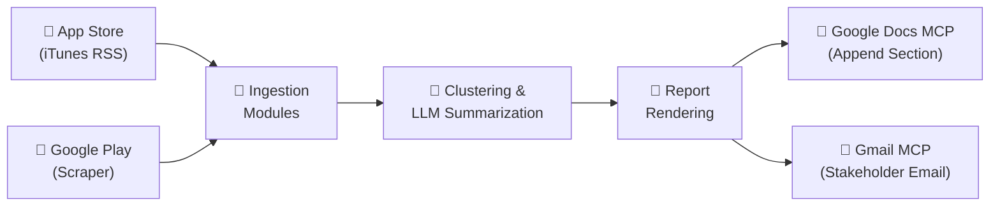
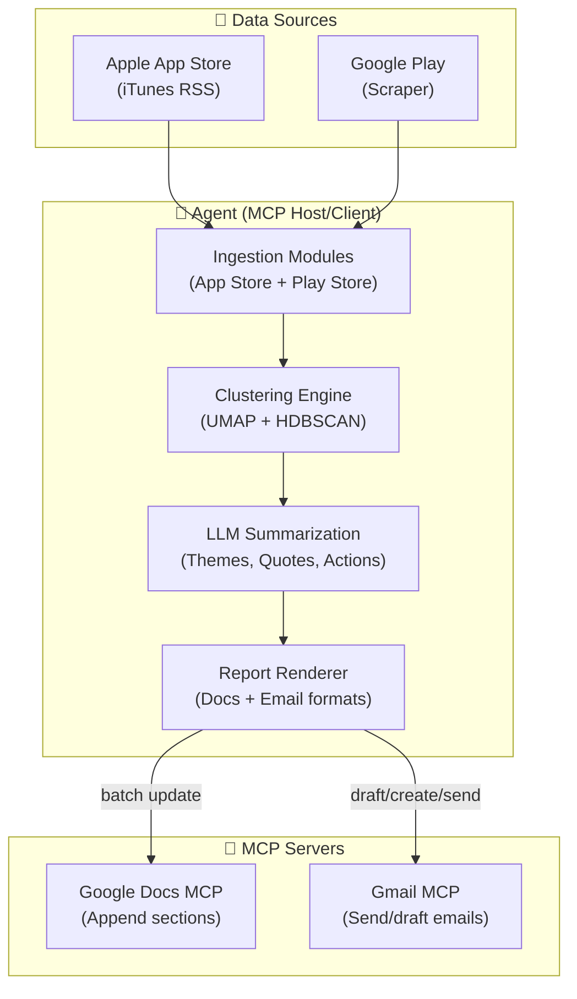
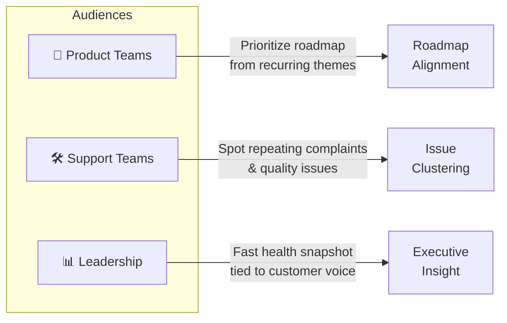
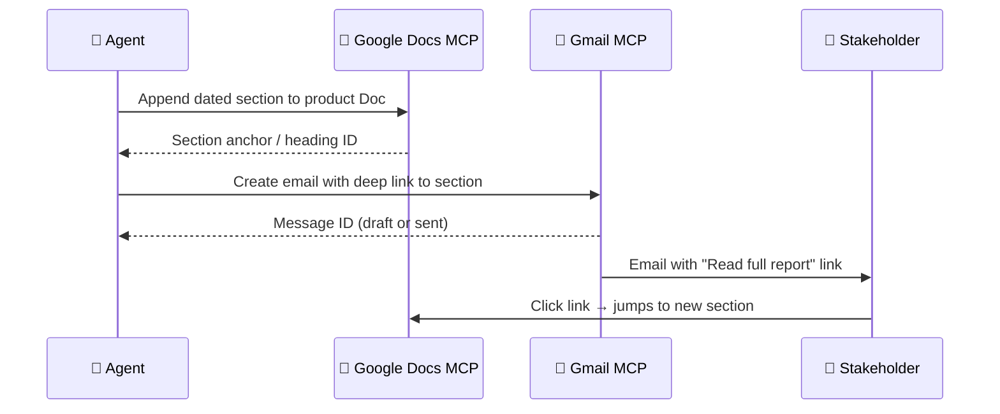

# 📋 Problem Statement — Automated Weekly App Review Pulse

> **Project**: Fintech App Review Pulse System  
> **Version**: 1.0  
> **Last Updated**: 2026-06-07  
> **Status**: Active

---

## 1. Executive Summary

We are building an **automated weekly "pulse"** that transforms public **App Store** and **Google Play** reviews for selected fintech products into a concise, one-page insight report and delivers it to stakeholders through **Google Workspace** — using **MCP (Model Context Protocol)** so that all writes to Google Docs and Gmail go through dedicated MCP servers, **not** ad hoc API calls inside the agent.

### Supported Products (Initial Scope)

| # | Product | Category |
|---|---------|----------|
| 1 | **INDMoney** | Wealth & Investment Management |
| 2 | **Groww** | Stock & Mutual Fund Trading |
| 3 | **PowerUp Money** | Personal Finance |
| 4 | **Wealth Monitor** | Portfolio Tracking |
| 5 | **Kuvera** | Direct Mutual Fund Investing |

---

## 2. Objective

> [!IMPORTANT]
> Give product, support, and leadership teams a **repeatable, weekly snapshot** of what customers are saying in store reviews — themes, representative quotes, and actionable ideas — **without manual copy-paste or one-off spreadsheets**.

The system eliminates the friction of manually collecting, reading, and categorizing hundreds of app reviews across multiple platforms and products. It creates a standardized, automated pipeline from raw review ingestion to stakeholder-ready insight delivery.

---

## 3. What the System Does

### 3.1 End-to-End Pipeline

### 3.2 Detailed Capabilities

#### 📥 Stage 1 — Review Ingestion

- **Ingest public reviews** from the **last 8–12 weeks** (configurable rolling window) from both platforms:
  - **Apple App Store**: iTunes customer-reviews RSS feed
  - **Google Play**: Scraper-based extraction
- Reviews are collected **per product**, across both stores simultaneously.

#### 🧠 Stage 2 — Clustering & Analysis

- **Cluster and rank feedback** using:
  - **Embeddings** for semantic representation of review text
  - **Density-based clustering** (e.g., UMAP + HDBSCAN) for discovering natural groupings
- **LLM-powered summarization** to:
  - Name themes with clear, human-readable labels
  - Pull **verbatim quotes** directly from reviews
  - Propose concrete **action ideas** for each theme

> [!WARNING]
> **Quote Validation**: All verbatim quotes **must** appear in actual review text. The system validates every quote against the source data to prevent hallucination.

#### 📄 Stage 3 — Report Rendering

- Render a **concise one-page narrative** containing:
  - 🏷️ **Top Themes** — ranked by density/frequency
  - 💬 **Real User Quotes** — validated verbatim excerpts
  - 💡 **Action Ideas** — specific, implementable recommendations
  - 👥 **"Who This Helps"** — audience-value mapping

#### 📬 Stage 4 — Delivery via MCP

Outputs are delivered **exclusively** through Google Workspace MCP servers:

| Delivery Channel | MCP Server | Behavior |
|-----------------|------------|----------|
| **Google Docs** | Google Docs MCP | Append each week's report as a **new dated section** to a single running document per product (e.g., *"Weekly Review Pulse — Groww"*). The Doc is the **system of record** and preserves full history. |
| **Gmail** | Gmail MCP | Send a short stakeholder email that includes a **deep link** to the new section in that Doc (heading link) — not a duplicate full report in email. |

---

## 4. Architecture — Separation of Concerns

> [!NOTE]
> The agent acts as an **MCP host/client**. It does **not** embed Google credentials or call the Docs/Gmail REST APIs directly for delivery.

| Concern | Where It Lives | Details |
|---------|---------------|---------|
| **Data Retrieval** | Ingestion Modules | App Store + Play Store scrapers/parsers |
| **Reasoning** | Clustering + LLM Summarization | Themes, quotes, action idea extraction |
| **Output Generation** | Report + Email Rendering | Structured content for Docs; HTML/text for Gmail |
| **Human-Visible Delivery** | MCP Tools Only | Google Docs MCP + Gmail MCP |

---

## 5. Key Requirements

### 5.1 MCP-Based Delivery

> [!IMPORTANT]
> All delivery operations — appending to the shared Google Doc and sending Gmail — must go through the **respective MCP servers' tools** (e.g., document batch update, draft/create/send flows as defined in architecture). No direct REST API calls for delivery.

### 5.2 Weekly Cadence

- Designed to run **once per product per week** (e.g., scheduled job Monday morning IST)
- Includes a **CLI for backfill** of any ISO week
- Supports both automated scheduling and manual triggers

### 5.3 Idempotent Runs

> [!CAUTION]
> Re-running the same **product + ISO week** combination must **not** create duplicate Doc sections or duplicate email sends.

Idempotency is enforced through:
- A **stable section anchor** in the Google Doc (prevents duplicate sections)
- A **run-scoped idempotency check** on email (prevents duplicate sends)

### 5.4 Auditability

Each run records:
- **Delivery identifiers** (e.g., doc heading, message IDs)
- Enough **metadata** to answer: *"What was sent, when, for which week?"*

### 5.5 Safety & Quality

| Safeguard | Description |
|-----------|-------------|
| **PII Scrubbing** | Applied on review text *before* LLM processing and *before* publishing |
| **Prompt Injection Defense** | Reviews are treated as **data**, not instructions |
| **Cost Controls** | Token and cost limits enforced **per run** |

---

## 6. Non-Goals (Explicit)

The following are **explicitly out of scope** for this project:

| Non-Goal | Rationale |
|----------|-----------|
| ❌ Generic Google Workspace product | We only need Docs append + Gmail send/draft — nothing more |
| ❌ Real-time streaming / BI dashboard | The running Google Doc **is** the living artifact |
| ❌ Social sources (Twitter, Reddit, etc.) | Not in initial scope; may be added later |
| ❌ Google OAuth secrets in agent codebase | Credentials belong in the **MCP servers' configuration**, per architecture |

---

## 7. Who This Helps

| Audience | Value Delivered |
|----------|----------------|
| **Product** | Prioritize roadmap from recurring themes across user reviews |
| **Support** | Spot repeating complaints and surface quality issues early |
| **Leadership** | Fast health snapshot tied directly to customer voice |

---

## 8. Sample Output (Illustrative)

Below is an example of what a generated pulse report looks like:

---

### 📊 Groww — Weekly Review Pulse

> **Period**: Last 8–12 weeks (rolling window)

#### 🏷️ Top Themes

| Theme | Summary |
|-------|---------|
| **App Performance & Bugs** | Lag, crashes during trading hours; login/session timeouts |
| **Customer Support Friction** | Slow responses; unresolved tickets |
| **UX & Feature Gaps** | Confusing navigation for portfolio insights; missing advanced analytics |

#### 💬 Real User Quotes

> *"The app freezes exactly when the market opens, very frustrating."*

> *"Support takes days to reply and doesn't solve the issue."*

> *"Good for beginners but lacks detailed analysis tools."*

#### 💡 Action Ideas

| Action | Details |
|--------|---------|
| **Stabilize Peak-Time Performance** | Scale infrastructure during market hours; improve crash visibility and monitoring |
| **Improve Support SLA Visibility** | Show expected response time in-app; add ticket status tracking |
| **Enhance Power-User Features** | Add advanced portfolio analytics; redesign investments navigation for clarity |

#### 👥 What This Solves

Same intent as today: **roadmap alignment** for product, **issue clustering** for support, and a **leadership-friendly snapshot** — now automated, archived in Google Docs, and announced by email with a link back to the canonical section.

---

## 9. Delivery Expectations (Stakeholder-Facing)

| Expectation | Detail |
|-------------|--------|
| **Doc Section** | Each run adds **one clearly labeled section** to the product's pulse Google Doc (dated / week-labeled) |
| **Email** | A brief teaser (e.g., top themes as bullets) plus a **"Read full report"** link to that section |
| **Staging Safety** | Development/staging defaults to **draft-only email** until explicit confirmation to send, per implementation plan |

---

## 10. Success Criteria

| Metric | Target |
|--------|--------|
| **Automation** | Zero manual intervention for weekly pulse generation |
| **Coverage** | All 5 initial products processed each week |
| **Accuracy** | 100% of quotes validated against source reviews |
| **Delivery** | Every run produces both a Doc section and a stakeholder email |
| **Idempotency** | Re-runs produce no duplicates |
| **Latency** | End-to-end pipeline completes within acceptable window for Monday delivery |

---

> [!TIP]
> This system is designed to be **extensible**. While the initial scope covers 5 fintech products and two review sources, the modular architecture allows straightforward addition of new products, new data sources, and new delivery channels in the future.
